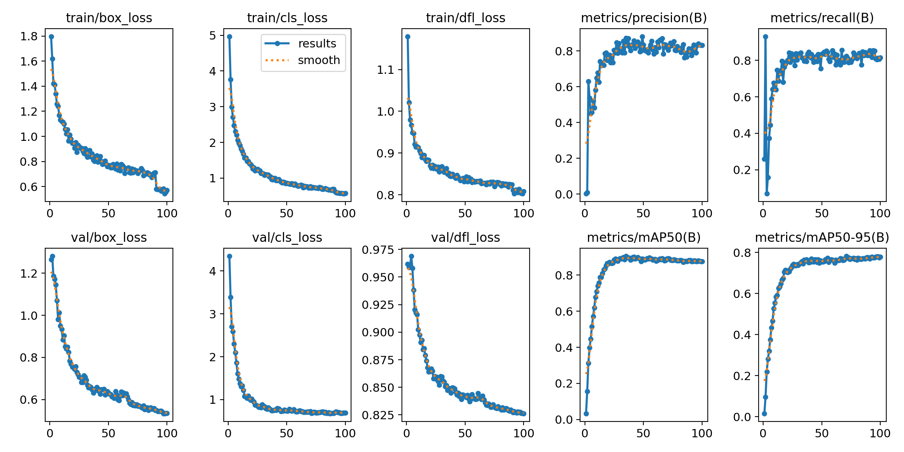
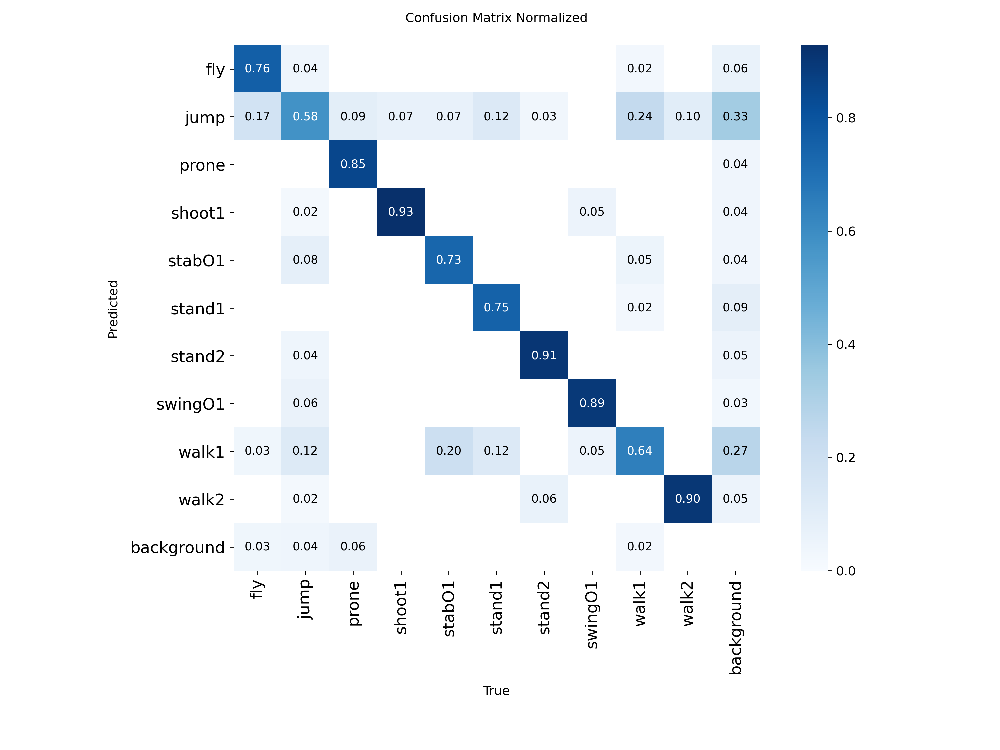
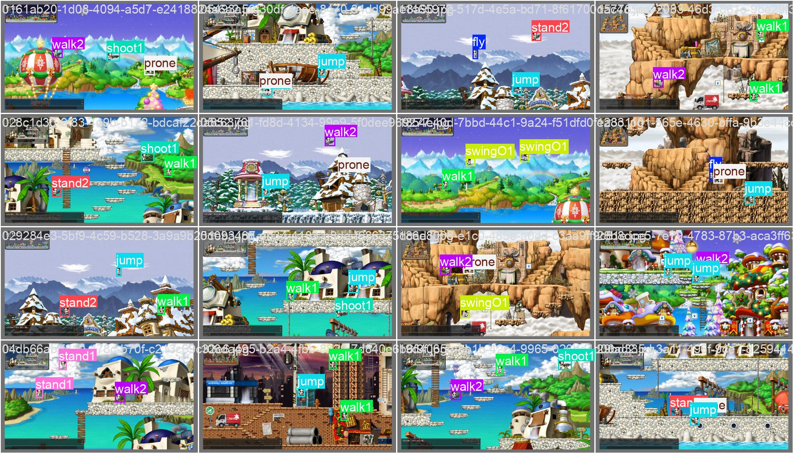
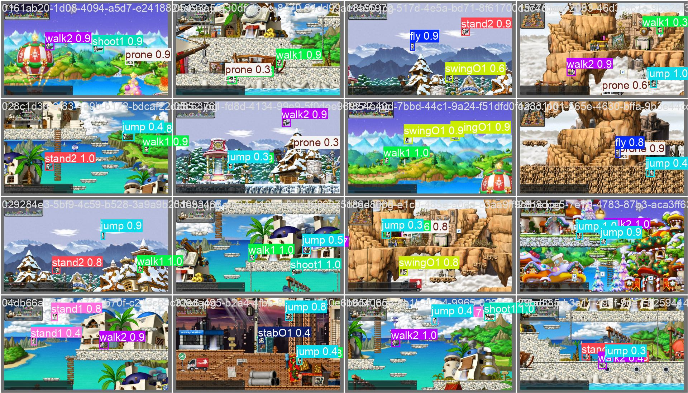

# 🍁Maple-Vision-Search

**Semantic Game Scene Retrieval & Situation Analysis System using YOLOv8 and CLIP**

본 프로젝트는 메이플스토리의 게임 시각 데이터를 YOLOv8 객체 탐지와 Jina-CLIP-v2 비전-언어 모델(VLM)을 결합하여 처리하며, 사용자의 자연어 쿼리에 부합하는 캐릭터의 자세(Pose)를 2단계 계층적 리랭킹 알고리즘을 통해 정밀하게 검색 및 분석하는 지능형 시맨틱 엔진입니다.

"엎드린", "점프하는", "fly" 등 영어/한국어로 된 포즈 관련 쿼리를 입력하면, 2단계 유사도 계산 로직 기반으로 주어진 데이터베이스의 수많은 이미지들 중 해당 포즈를 취하고 있는 캐릭터가 있는 이미지의 파일명을 출력합니다.

## 1. Project Overview

* **배경**: 게임에서 발생하는 방대한 스크린샷 및 영상 데이터에서 특정 상황(예: 특정 보스 사냥, 아이템 강화 성공 등)을 키워드만으로 검색하는 것은 한계가 있음.
* **목표**: YOLOv8을 통한 정밀 객체 탐지와 Jina-CLIP-v2의 시맨틱 임베딩을 결합하여, 자연어 기반의 멀티모달 검색 파이프라인 구축.
* **핵심 가치**: 소규모 데이터로도 두 모델의 학습에 필요한 합성 데이터 수집 및 라벨링 자동화 파이프라인을 구축하고, 게임 플레이 화면의 의미론적 맥락 이해를 통한 **Semantic Retrieval** 구현.

---

## 2. System Pipeline

본 시스템은 데이터 생성부터 최종 검색까지 유기적으로 연결된 4단계 파이프라인으로 구성됩니다.

1. **Data Generation**: 캐릭터의 포즈별 png 데이터로 랜덤 배경맵 합성 이미지 데이터와 해당 게임 화면 이미지에서 캐릭터가 배치된 위치 데이터를 생성하여 Ground Truth 확보.
    - 포즈 예시 : prone, fly, jump 등
    - 배경맵 예시 : 헤네시스, 엘리니아, 커닝시티 등
    생성된 합성 이미지 속 캐릭터의 포즈 클래스 라벨링이 되어있지 않아서, 이를 자동화하기 위해 MobileNet을 전이학습 시킴.`01_pose_classification_model.ipynb`
2. **Object Detection**: YOLOv8을 전이학습 시켜서, 새롭게 주어지는 게임 화면 이미지 내 주요 객체(Player, Mob)의 위치 및 포즈 탐지.
3. **Vector Indexing**: 한국어가 지원되는 Jina-CLIP-v2 모델로 이미지와 텍스트 데이터를 벡터화하여 고차원 임베딩 공간에 저장.
4. **Semantic Search**: 사용자의 자연어 질문을 벡터로 변환한 후, 2단계 코사인 유사도 계산 기반의 근사 최근접 이웃 검색 수행.

---

## 3. Technical Stack

| Category | Technology | Description |
| --- | --- | --- |
| **Object Detection** | **YOLOv8** | 실시간 객체 탐지 및 바운딩 박스 추출 |
| **VLM / Retrieval** | **Jina-CLIP** | 한국어 기반으로 이미지-텍스트 멀티모달 임베딩 및 유사도 비교 |
| **Vector DB** | **Faiss** | 대규모 벡터 데이터의 효율적 인덱싱 및 유사도 검색 |
| **Data Engineering** | **Python, MobileNet** | 합성 데이터 생성 및 전처리 파이프라인 구현 |
| **Framework** | **PyTorch** | 딥러닝 모델 학습 및 추론 환경 |

---

## 4. 데이터 구축 전략 (Data Construction Strategy)

### **Data Generation**

* **방법론 차용 **: 오픈소스 프로젝트인 [MapleStoryDetectionSampleGenerator]를 데이터 구축의 핵심 도구로 활용함. 해당 제너레이터는 캐릭터와 몬스터 등의 투명 PNG 에셋을 입력받아 다양한 게임 배경 이미지와 무작위로 합성하여 대량의 게임 화면 이미지 데이터를 생성함.

* **데이터 신뢰도 확보**: 해당 프로젝트의 생성기는 이미지 생성과 동시에 각 객체의 렌더링 좌표를 기반으로 바운딩 박스(Bounding Box) 정보를 표준화된 라벨 포맷으로 자동 추출함. 이를 통해 수동 라벨링 과정에서 발생할 수 있는 인적 오류(Human Error)를 근본적으로 차단하고, 픽셀 단위의 정밀도가 보장된 고정밀 Ground Truth 데이터셋을 확보함. 실제로 해당 생성기은 약 5,000개의 샘플로 YOLOv4 기준 $99.8\% mAP$의 성능을 기록하여 신뢰 가능한 데이터의 유효성을 가지고 있음.

---

## 5. 실무적 활용 방안 (Practical Use Cases)

### 1. 운영 및 개발 효율화

* **게임 내 이상현상 검색 자동화**: "캐릭터가 지형지물 아래로 빠진 장면" 등 특정 렌더링 이상 현상을 자연어로 검색하여 전수 조사 및 수정 작업 시간 단축.
* **이상 패턴 분석**: 비정상적인 객체 집중이나 특정 스킬 이펙트가 반복되는 로그 이미지를 시맨틱하게 분류하여 어뷰징 조사 도구로 활용.

### 2. 기타
* One-Stage detector인 YOLO 모델을 사용하므로, 추후 게임 플레이 중 **실시간**으로 수집 되는 데이터에 대한 활용도 가능할 것으로 보임.

---

## 6. 검색 시스템 개발 중 Trouble Shooting

### 1. 문제 인식 (Problem Recognition)

* **도메인 간극**: 사전 학습된 CLIP 모델은 실사 이미지 위주로 학습되어 있어, 메이플스토리와 같은 **2D 픽셀 아트의 추상적인 포즈 특징**을 추출하는 데 취약함.
* **정확도 저하**: 사용자의 자연어 쿼리와 캐릭터 이미지 간의 시각적 유사도만으로는 검색 결과의 신뢰도를 보장할 수 없음.

### 2. 해결 과정 (Thought Process)

* **사전에 만든 데이터 활용**: 프로젝트의 4단계에서 직접 구축하여 80% 이상의 정확도를 확보한 **YOLOv8/MobileNet의 포즈 라벨 데이터**를 시스템의 판단 근거로 추가함.
* **리랭킹 로직 고안 **: 단순히 이미지 데이터 - 텍스트 데이터 간 유사도로 검색 결과를 출력하는 게 아닌, 텍스트 데이터(쿼리) - 텍스트 데이터(라벨) 간 유사도 계산 단계를 추가해 시스템 신뢰도를 높임.

### 3. 리랭킹 로직 요약 (Logic Summary)

1. **Stage 1 (텍스트 데이터 - 이미지 데이터 간 유사도 계산)**: 텍스트 데이터(입력 쿼리) - 이미지 데이터(크롭 이미지) 벡터 간의 유사도를 계산하여 전체 데이터 중 상위 개의 후보군을 1차로 추출함.
2. **Stage 2 (텍스트 데이터 - 텍스트 데이터 간 유사도 계산)**: 추출된 후보군에 대해 '쿼리 텍스트'와 '포즈 라벨 텍스트' 간의 유사도를 추가 계산함.
3. **최종 정렬**: 두 유사도 점수를 가중치에 따라 합산하여 Score를 구해 최종 순위를 결정하고 상위 개를 출력함.

---
## 7. 포즈 분류 모델과 검색 모델 최종 성능

### 7.1 YOLOv8 기반 - 객체 탐지 및 포즈 분류 모델 최종 성능

① mAP50 ($0.8600$) : 객체의 위치를 정확히 찾고 클래스를 분류할 확률이 86%

② Mean Recall ($0.8109$) : 화면에 있는 캐릭터 10마리 중 약 8마리 이상을 놓치지 않고 찾아냄

③ Mean Precision ($0.7463$) : 모델이 '1번 포즈'라고 예측한 것 중 실제 1번 포즈일 확률이 75%이며, Recall에 비해 낮은 수치는 배경의 일부를 캐릭터로 오인하거나, 포즈를 잘못 판단한 경우가 종종 발생함을 시사

④ 추론 속도 (Total $\approx 5.36ms$) : Pre + Inference + Post 프로세스를 합쳐 장당 약 $5.4ms$가 소요. 이를 FPS로 환산하면 약 $186$ FPS.

1. 결과 곡선

2. 혼동 행렬

#### 라벨 vs 예측 비교
1. 라벨

2. 예측

### 2. Jina-CLIP 기반 - 검색 모델 최종 성능
① 2D 픽셀 이미지 데이터의 특수성

- 모든 예시에서 $ImgSim$이 $0.2$대로 매우 낮게 측정 됨. 

- 이는 실사 이미지 기반으로 사전 학습된 Jina-CLIP-v2(또는 일반 CLIP) 모델이 메이플스토리와 같은 2D 픽셀 캐릭터의 시각적 특징을 추출하는 데 취약함을 입증

② 텍스트 임베딩의 성능 및 다국어 지원 

- 한국어 쿼리에서도 $ TxtSim $이 $0.59$이상을 상회하며 안정적인 수치를 보임.

- 영어 쿼리가 라벨명과 일치할 경우 $TxtSim$이 $1$에 근접하는 점을 통해, Jina-CLIP-v2의 텍스트-텍스트 매칭 성능이 매우 강력함을 알 수 있음.

③ 쿼리 구성 및 가중치의 영향(추정)

- 미사여구의 영향: 쿼리에 의미 없는 수식어가 포함될 경우 텍스트 벡터의 집중도가 분산되어 $TxtSim$이 약 $0.2$ 가량 하락하고 최종 점수($Score$)에도 부정적인 영향을 미침.

- 가중치($\alpha$)의 역할: 시각적 유사도 비중($\alpha$)을 높일수록 모델의 취약점인 이미지 데이터의 영향력이 커져 전체 시스템의 신뢰도(Score)가 하락하는 경향을 보임.

